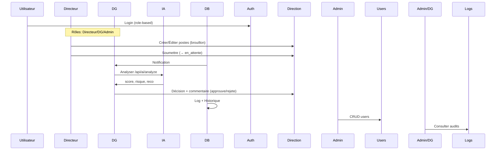

# Classes du Projet et Workflow
## Dashboard de Prévision Budgétaire

### 1. Classes Principales (Modèles Backend - Mongoose Schemas)

#### **User** (Utilisateurs)
```javascript
const UserSchema = new mongoose.Schema({
  nom:        { type: String, required: true },
  prenom:     { type: String, required: true },
  email:      { type: String, required: true, unique: true },
  motDePasse: { type: String, required: true },
  role: {
    type: String,
    enum: ["Admin", "Directeur", "Directeur Generale", "DG"],
    default: "Directeur"
  },
  direction: { type: String, default: "-" },
  status:    { type: String, enum: ["actif", "inactif"], default: "actif" },
  tentativesEchouees: { type: Number, default: 0 },
  bloqueJusqua:       { type: Date, default: null }
}, { timestamps: true })

// Méthode: estBloque()
```
**Rôles:** Admin (gestion users), Directeur (soumet budgets), DG (approuve/IA).

#### **Direction** (Directions Budgétaires)
```javascript
// Sub-schema: Poste
const PosteSchema = new mongoose.Schema({
  nom:       { type: String, required: true },
  categorie: { type: String, default: "Autre" },
  montant:   { type: Number, default: 0 },
  montantN1: { type: Number, default: 0 }
}, { _id: false })

const DirectionSchema = new mongoose.Schema({
  code:      { type: String, required: true, unique: true },
  nom:       { type: String, required: true },
  directeur: { type: String, default: null },
  budget:   { type: Number, default: 0 },
  budgetN1: { type: Number, default: 0 },
  postes:         { type: [PosteSchema], default: [] },
  totalDemande:   { type: Number, default: null },
  statut: {
    type: String,
    enum: ["brouillon", "en_attente", "approuve", "rejete"],
    default: "brouillon"
  },
  soumisLe: { type: Date, default: null },
  commentaireDG: { type: String, default: null }
}, { timestamps: true })
```
**États:** brouillon → en_attente (soumis) → approuve/rejete (DG).

#### **AIDecision** (Décisions IA)
```javascript
const aiDecisionSchema = new mongoose.Schema({
  directionCode: String,
  decision: String,
  score: { type: Number, default: 0 },
  risque: { type: String, enum: ['FAIBLE', 'MOYEN', 'ELEVE'] },
  recommandation: { enum: ['APPROUVER', 'REJETER', 'ANALYSER', 'EN_ATTENTE'] },
  facteurs: [{ detail: String, impact: String }],
  budgetAlloue: Number,
  budgetDemande: Number
}, { timestamps: true })
```

#### **Historique** (Archive Annuel)
```javascript
annee, code, nom, budget, totalDemande, statut, commentaireDG
```

#### **Log** (Audit)
```javascript
type ("Création", "Modification", etc.), action, user
```

#### **ResetToken** (Reset Mot de Passe)
```javascript
userId, token, expiresAt (TTL 1h)
```

### 2. Workflow Principal



**Étapes clés:**
1. **Authentification** → Accès role-based.
2. **Directeur:** Édite postes → Soumet direction.
3. **DG:** Analyse IA → Approuve/Rejette → Archive.
4. **Admin:** Gère users/logs.

### 3. API Endpoints (Express Routes)

| Route | Méthodes | Accès | Description |
|-------|----------|--------|-------------|
| `/api/auth` | POST /login, /mot-de-passe-oublie, /reinitialiser | Public | Auth + reset PW |
| `/api/users` | GET/POST/PUT/DELETE | Admin (CRUD), User (own email/pw) | Gestion users |
| `/api/directions` | GET/POST/PUT/DELETE, /:id/soumettre/decision/reset | Directeur (own), DG/Admin | Budget workflow |
| `/api/logs` | GET | Admin/DG | Audit logs |
| `/api/ai` | GET/POST/DELETE /history, /analyze/:id, /chat | DG/Admin | IA analyses |

**Middleware:** `verifyToken`, `adminOnly`, `dgOnly`, `adminOrDG`.

### 4. Modules Frontend (React Components/Pages)
- **Communs:** App.jsx, LoginPage.jsx, PrivateRoute.jsx, Themeprovider.jsx.
- **Directeur:** Directeurdashboard.jsx, Directeurbudget.jsx, Directeurhistorique.jsx, Directeursidebar.jsx.
- **DG:** DGDashboard.jsx, DGDetail.jsx, DGDemandes.jsx, DGHistorique.jsx, DGStatistiques.jsx, Dgsidebar.jsx.
- **Autres:** Account.jsx (users), Audit.jsx (logs), AI components (AIAssistant.jsx, RiskBadge.jsx).
- **Data/APIs:** axios.js, budgetStructure.js.

Serveur: Express + MongoDB (PORT=5000). Frontend: Vite + React + Tailwind.

